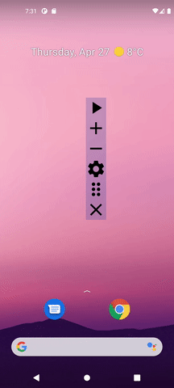
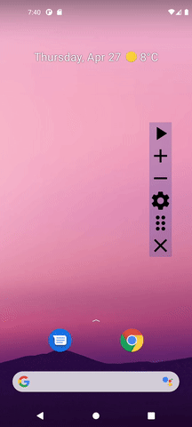
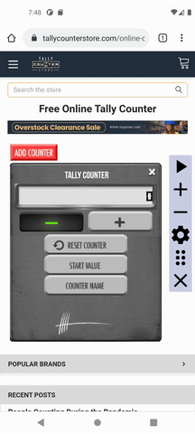
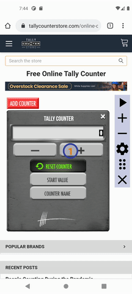

# AutoClicker
AutoClicker is an Android app designed to automate repetitive tasks on your phone. With AutoClicker,
you can create macros that allow you to click on specific areas of the screen at set intervals, 
enabling you to perform tasks automatically. This can save you time and effort, especially if you 
need to perform the same action repeatedly. Whether you want to automate gaming tasks or streamline 
your workflow, AutoClicker can help you get the job done.
## Author
Mateusz Skolimowski
 
https://www.linkedin.com/in/mateusz-skolimowski-337008126/
## TODO list
- [x] Display Action bar as Accessibility Service
- [x] Make Action bar draggable
- [x] Close Action bar image 
- [x] Add/Remove Click Point 
- [x] Make Click Points draggable 
- [x] Perform click on x:y 
- [x] Run macro
- [x] Edit macro configuration - infinite / cycles count
- [x] Edit click point configuration - delay
- [x] Add examples section to README
- [x] Material3
- [ ] Save macro in config window
  - [ ] create buttons load, save if its new config or load, edit, delete if its already in db
- [ ] Load macro
- [ ] Clean up fragment - remove unused code
  - [ ] handle accessibility service state from fragment 
    - [ ] show if accessibility service is turned on
    - [ ] show button that on click navigate to accessibility settings where user can start accessibility service

#### Future ideas
- [ ] Enable click on image beside x:y

## Examples
|             drag              |             close              |          multiple click points           |             multiple cycles              |
|:-----------------------------:|:------------------------------:|:----------------------------------------:|:----------------------------------------:|
|  |  | | |
